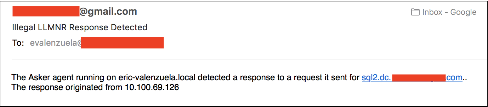

# asker - LLMNR Honeypot
counterpart to [Responder.py](https://github.com/SpiderLabs/Responder)

This tool takes a list of known-bogus local hostnames, and sends out LLMNR requests for them every 5-25 legitimate LLMNR requests from other hosts.

This is intended for use by a blue team who wants to catch a red team or attacker using [Responder](https://github.com/SpiderLabs/Responder), who either does not target-select carefully enough, or falls for the bogus hostnames which should be tailored to the environment (e.g. if there is a DC named "addc1", you might want to add "adddc1" to the list.

**note: this tool requres [scapy](https://github.com/secdev/scapy) to be installed.**

**note2: if you receive errors about vboxnet not being a valid interface from ifconfig on 'import scapy.all', this is an issue with scapy that I cannot fix, and will affect any programs using scapy's 'route' module. To resolve, run "sudo ifconfig vboxnet(n) down" for any virtualbox network adapters. I've only seen this is OS X, but it should apply in Linux as well.**

#### Running the script
(I know the bait names change; I put these together over a long period of testing and I'll fix it later...)

Once the script starts, it will begin sniffing LLMNR packets on the local network. After enough requests are seen, it will construct and send its own.

The packet will show up as an "ANY" type DNS query and be treated by Responder as any other LLMNR request:

Once it responds to the request...

the response will be identified and alerted on:

**Ctrl-C interrupts the sniff() loop instance, sending out an LLMNR phish. To interrupt the program, use Ctrl-Z, then 'sudo killall python'.**

If the email options are provided when run, an email will be sent(max once every 5 minutes) when an alert is tripped.

