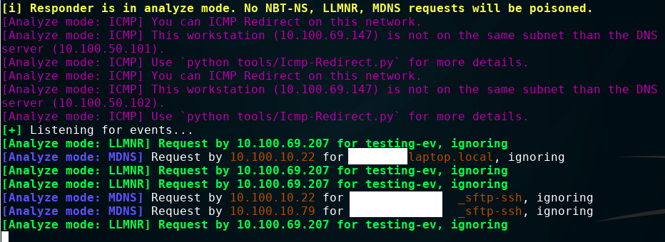

# asker
counterpart to Responder.py

This tool takes a list of known-bogus local hostnames, and sends out LLMNR requests for them every 5-25 legitimate LLMNR requests from other hosts.

This is intended for use by a blue team who wants to catch a red team or attacker using Responder, who either does not target-select carefully enough, or falls for the bogus hostnames which should be tailored to the environment (e.g. if there is a DC named "addc1", you might want to add "adddc1" to the list.

#### Running the script

Once the script starts, it will begin sniffing LLMNR packets on the local network. After enough requests are seen, it will construct and send its own.

The packet will show up as an "ANY" type DNS query...

and be seen by Responder as any other LLMNR request:

